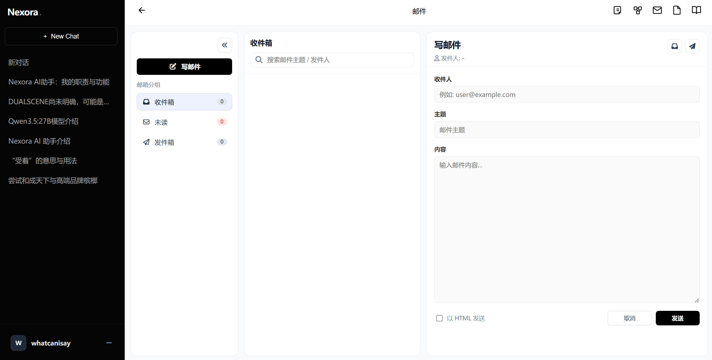
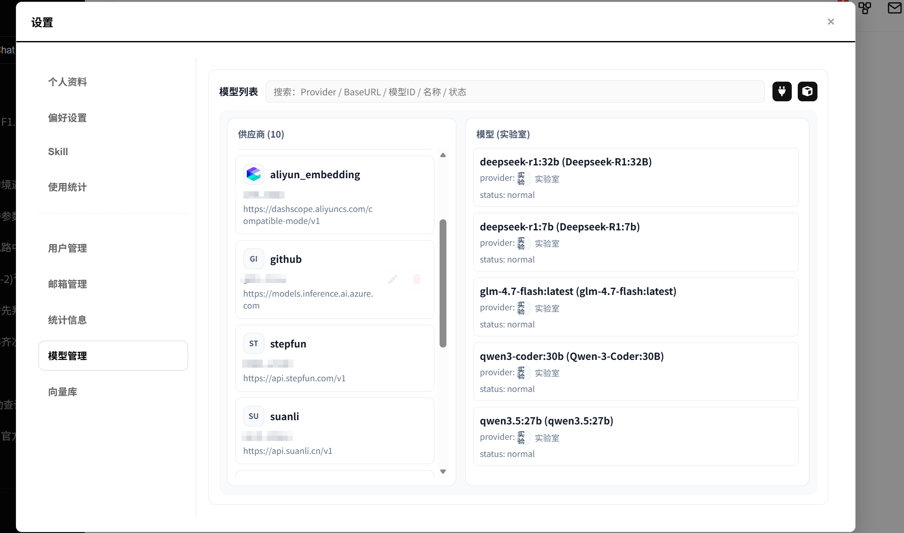
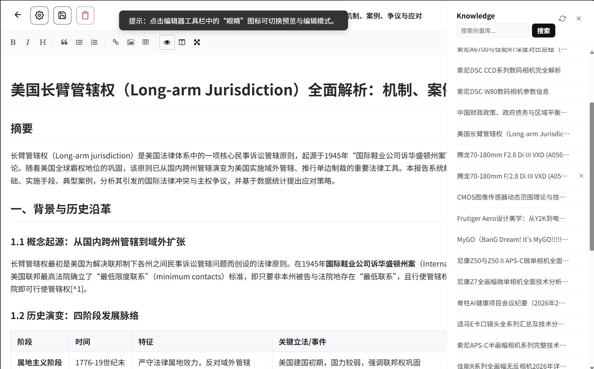
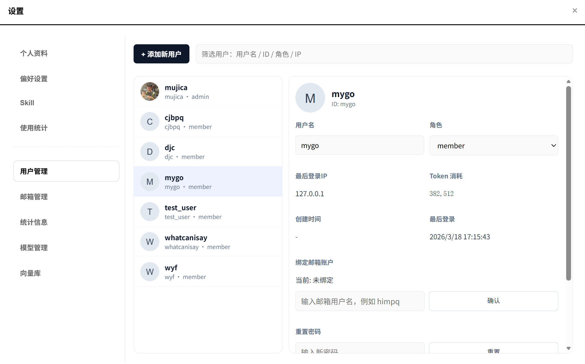
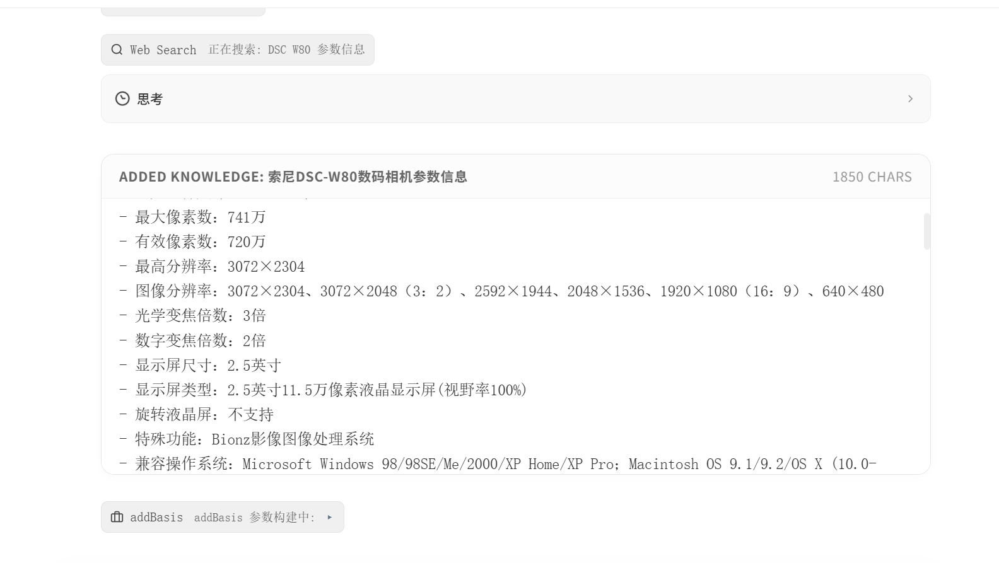

# Nexora

Nexora is a self-hosted AI chat platform with knowledge graph visualization and conversation memory.
  
## 

Introduction Website:
https://chat.himpqblog.cn

## Features

- Decouplable email, RAG, and cloud storage components

- Support for multiple providers including Volcengine, DashScope, OpenAI, and more

- Knowledge base management with vector databases and file storage

- Multiple user support with role-based access control

- Multiple function call tools for enhanced capabilities


## Components
### NexoraMail 
(https://github.com/Himpq/wMailServer)
NexoraMail is an email service that supports sending and receiving emails. It can be used for user registration, password recovery, and other email-related functions.
It's providing function tools for LLM to send emails, check inbox, and read email content.
To build the NexoraMail component, you may need a 25 port and domain (for Worldwide deployment).
### NexoraDB
NexoraDB is a **Vector Database** based on ChromaDB. It provides vector storage and retrieval capabilities for the knowledge base. It also supports function tools for LLM to manage the knowledge base, including adding, deleting, and searching for knowledge.
You can choose different embedding models by configuring the settings.
### NexoraNetdisk
NexoraNetdisk is a file storage service that supports uploading and downloading files. It can be used for storing files related to the knowledge base, such as documents, images, and other resources.
### NexoraCode
NexoraCode is a Openclaw-liked software that provides code execution, file modifying, local web rendering and other tools for LLM. You can interact with LLM and operate your computers.

It needs a sandbox environment, we haven't planned to do it for now, so please use it with caution and make sure to backup your data regularly.

## Installation
```bash
git clone https://github.com/Himpq/Nexora.git
cd Nexora

pip install -r requirements.txt

cd ChatDBServer
python main.py
```


## Notice
- You need to configure user accounts in `ChatDBServer/data/user.json`
- This project **does not provide LLM models**, you need to setup with ollama or cloud providers.

We are not supposed to take the responsibility for any data loss or security issues caused by using this project. Please use it at your own risk and make sure to backup your data regularly.